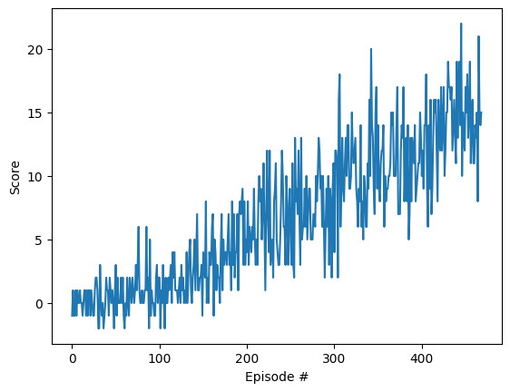

# Deep Q-Network (DQN) Agent for Banana Navigation

## 1. Learning Algorithm

### Algorithm Overview

This project implements the **Deep Q-Network (DQN)** algorithm, a foundational deep reinforcement learning technique that combines Q-learning with deep neural networks. The agent learns to navigate an environment and collect yellow bananas while avoiding blue ones by estimating the expected cumulative reward for each possible action in a given state.

### Key Components

#### Q-Learning with Function Approximation
The DQN algorithm uses a neural network to approximate the action-value function Q(s,a), which represents the expected cumulative discounted reward for taking action *a* in state *s*. The update rule is:

```
Q_target = r + γ * max(Q(s', a'; θ_target))
Loss = MeanSquaredError(Q(s, a; θ_local) , Q_target)
```

#### Experience Replay
To break temporal correlations and improve sample efficiency, experiences are stored in a replay buffer and sampled randomly during training. This stabilizes the learning process and reduces variance in gradient estimates.

#### Target Network
Two neural networks are maintained:
- **Local Network (θ_local)**: Updated every training step, used to select and evaluate actions
- **Target Network (θ_target)**: Updated slowly using soft updates, used to compute target Q-values

This decoupling helps stabilize learning by reducing the correlation between the Q-value targets and the network parameters being updated.

### Hyperparameters

| Parameter | Value | Description |
|-----------|-------|-------------|
| **BUFFER_SIZE** | 100,000 | Maximum size of the replay memory |
| **BATCH_SIZE** | 64 | Number of samples used in each training iteration |
| **GAMMA** | 0.99 | Discount factor for future rewards |
| **TAU** | 0.001 | Soft update parameter for target network (θ_target = τ*θ_local + (1-τ)*θ_target) |
| **LR** | 5e-4 | Learning rate for Adam optimizer |
| **UPDATE_EVERY** | 4 | Training frequency (learn every 4 environment steps) |
| **n_episodes** | 2000 | Maximum training episodes |
| **max_t** | 1000 | Maximum number of timesteps per episode |
| **eps_start** | 1.0 | Initial epsilon for ε-greedy exploration |
| **eps_end** | 0.01 | Minimum epsilon value |
| **eps_decay** | 0.995 | Multiplicative decay for epsilon each episode |

### Neural Network Architecture

The Q-network is a simple fully-connected feedforward neural network:

```
Input Layer (37 units) → ReLU
Hidden Layer 1 (128 units) → ReLU
Hidden Layer 2 (64 units) → ReLU
Output Layer (4 units)
```

**Architecture Details:**
- **Input Size**: 37 (state space dimension)
  - Ray-based perception of objects around the agent's forward direction
  - Agent's velocity information
- **Hidden Layer 1**: 128 neurons with ReLU activation
- **Hidden Layer 2**: 64 neurons with ReLU activation
- **Output Size**: 4 (action space dimension)
  - Action 0: Move forward
  - Action 1: Move backward
  - Action 2: Turn left
  - Action 3: Turn right

This architecture balances computational efficiency with sufficient representational capacity for the task.

## 2. Plot of Rewards


### Training Curve



The reward plot clearly illustrates:
- A steady upward trend in performance
- Increasing consistency as the agent learns
- Convergence to a high-performance policy
- The agent crosses the target threshold (+13) in 368 episodes

## 3. Ideas for Future Work

### Algorithm Enhancements

 **Double DQN (DDQN)**
   - Address the overestimation bias in Q-values by using the local network to select actions and the target network to evaluate them
   - Implementation: Use `Q_target = r + γ * Q_target(s', argmax_a(Q_local(s', a)))`
   - Expected Improvement: More stable learning and potentially faster convergence

**Dueling DQN**
   - Separate the Q-network output into value (V) and advantage (A) streams
   - Architecture: Split the final layers into two pathways before combining: Q(s,a) = V(s) + A(s,a) - mean(A)
   - Expected Improvement: Better learning efficiency by explicitly modeling state values vs action advantages

**Prioritized Experience Replay (PER)**
   - Weight replay samples based on their temporal-difference (TD) error
   - Focus training on important experiences (large errors) rather than uniform random sampling
   - Expected Improvement: Faster convergence and better sample efficiency


### Hyperparameter Optimization

**Hyperparameter Tuning**
   - Use grid search or Bayesian optimization to find optimal hyperparameter values
   - Particularly focus on: learning rate (LR), discount factor (GAMMA), and exploration decay (eps_decay)
   - Expected Improvement: Potentially faster convergence and higher final performance

**Network Architecture Search**
   - Experiment with different hidden layer sizes, depths, and activation functions
   - Test alternative architectures: deeper networks, wider networks